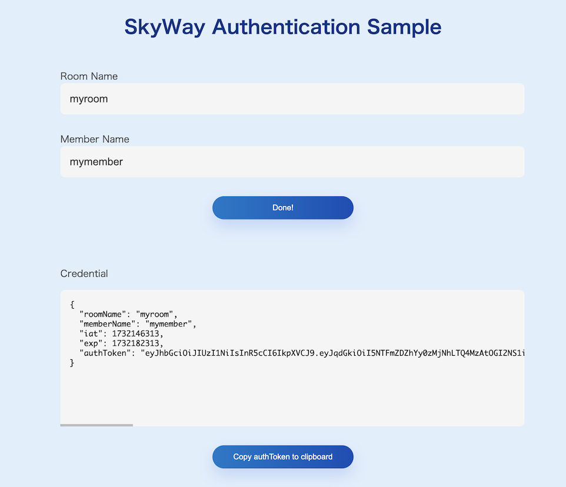

# SkyWay Authentication Sample

このリポジトリには、SkyWayで利用する認証情報を生成・取得するサンプルがあります。

SkyWayにおける認証について、詳細は[こちら](https://skyway.ntt.com/ja/docs/user-guide/authentication/)をご覧ください。

## サーバーアプリケーション

`/authenticate`にてPOSTリクエストを受け付け、認証情報の発行を行います。

### NodeJSサーバー

nodejsディレクトリに移動して依存ライブラリをインストールし、`npm start`コマンドで起動してください。
8080ポートを使用します。

```
cd nodejs
npm i
npm start
```

## クライアントアプリケーション

サーバーアプリケーションにリクエストを行い、認証情報を取得します。

clientディレクトリをホスティングし、ブラウザから`index.html`にアクセスしてください。

### 操作方法
1. Room Name、Member Nameのテキストボックスに文字列を入力します。
2. Get credentialボタンを押下します。
3. 認証情報の取得に成功すると、結果がCredentialのエリアにJSON形式で出力されます。
    - `authToken`がアプリケーションからSkyWayを利用する際に必要となります
4. Copy authToken to clipboardボタンを押下することで、クリップボードに `authToken`がコピーされます。

### スクリーンショット

 

## 公開リポジトリの運用方針について

このリポジトリは公開用のミラーリポジトリであり、こちらで開発は行いません。

### Issue / Pull Request

受け付けておりません。

Enterpriseプランをご契約のお客様はテクニカルサポートをご利用ください。
詳しくは[SkyWayサポート](https://support.skyway.ntt.com/hc/ja)をご確認ください。